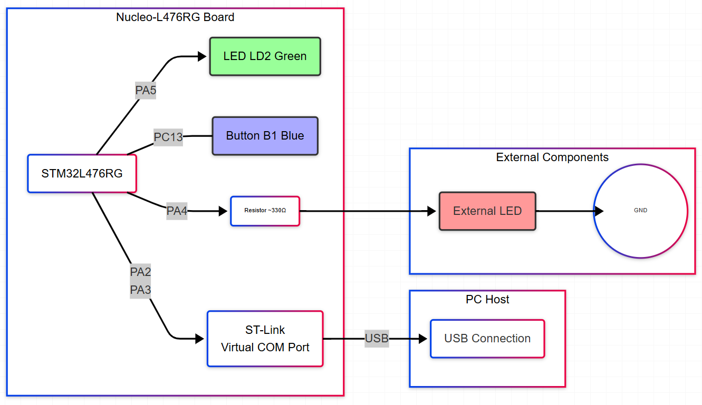

# Guía de Configuración del Entorno

Este documento detalla los requisitos de hardware, software y los pasos iniciales para configurar el proyecto del taller.

## 1. Conexiones de Hardware

Realiza las siguientes conexiones en tu protoboard:

*   **LED Heartbeat (Integrado):** LD2 (Verde) en la placa, conectado a **PA5**. No requiere conexión externa.
*   **Botón de Usuario (Integrado):** B1 (Azul) en la placa, conectado a **PC13**. No requiere conexión externa.
*   **LED Externo ON/OFF:**
    *   Conecta el ánodo de un LED a **PA4** (o el pin GPIO que elijas).
    *   Conecta el cátodo del LED a una resistencia, y el otro extremo de la resistencia a **GND**.
*   **LED Externo PWM:**
    *   Conecta el ánodo de otro LED a **PB4** (TIM3_CH1).
    *   Conecta el cátodo del LED a una resistencia, y el otro extremo de la resistencia a **GND**.
*   **UART2 (Virtual COM Port via ST-Link):**
    *   **PA2 (USART2_TX)**
    *   **PA3 (USART2_RX)**
    *   Estas conexiones son internas a través del ST-Link. Solo necesitas conectar el cable USB de la Nucleo al PC.

**Diagrama de Conexiones (Ejemplo):**



## 2. Creación del Proyecto

1. **Forkea El Repositorio:** A partir del repositorio del profesor, crea una copia en tu cuenta de GitHub (Fork).
2.  **Clona el Repositorio:** Si se proporciona un repositorio base, clónalo.
    ```bash
    git clone <URL_DEL_REPOSITORIO_FORKEADO>
    ```
3.  **Estructura del Proyecto:**
    ```
    NombreDelProyecto/
    ├── cmake/
    │   ├── gcc-arm-none-eabi.cmake
    │   └── vscode_generated.cmake
    ├── Inc/
    │   ├── systick.h
    │   ├── nvic.h
    │   ├── rcc.h
    │   ├── gpio.h
    │   ├── tim.h
    │   ├── uart.h
    │   └── room_control.h
    ├── Src/
    │   ├── main.c
    │   ├── systick.c
    │   ├── nvic.c
    │   ├── rcc.c
    │   ├── gpio.c
    │   ├── tim.c
    │   ├── uart.c
    │   └── room_control.c
    ├── Startup/
    │   └── startup_stm32l476rgtx.s // Archivo de arranque
    ├── stm32l476rgtx_FLASH.ld     // Linker Script
    └── Makefile (o CMakeLists.txt)  // Archivo de compilación
    ```
3.  **Configuración del Build System (Makefile/CMake):**
    *   Asegúrate de que tu `cmake/vscode_generated.cmake` esté configurado para compilar todos los archivos `.c` de la carpeta `Src/` y el archivo `.s` de `Startup/`.

## 5. Compilación y Carga Inicial

1.  **Compila el proyecto:**
    *   Presiona el boton "Build" o "Version de Compilacion"
2.  **Carga el firmware:**
    *   Presiona "F5" para programar el MCU e inciar una sesion de depuracion.
3.  **Verifica la conexión serial:**
    *   Abre tu terminal serial, conéctate al puerto COM correspondiente al ST-Link de tu Nucleo.
    *   Configuración: 115200 baudios, 8 bits de datos, sin paridad, 1 bit de parada (8N1).

Ahora estás listo para empezar a desarrollar los módulos. Dirígete a [Infraestructura del Proyecto (Doc/INFRASTRUCTURE.md)](Doc/INFRASTRUCTURE.md).